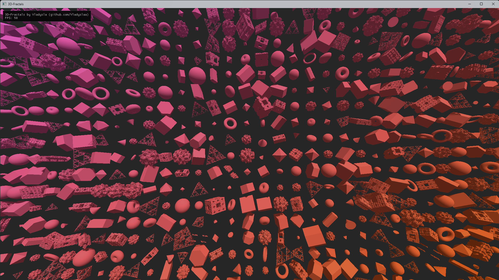
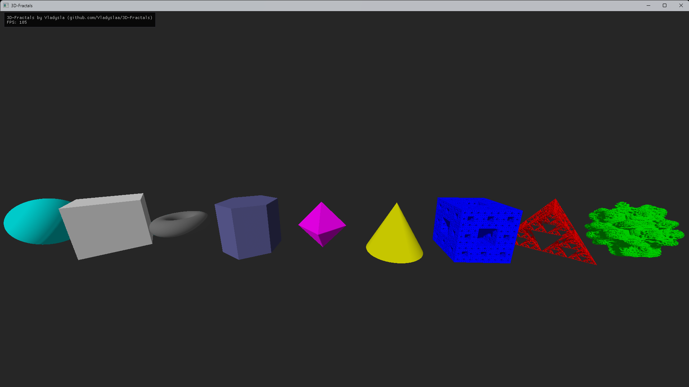
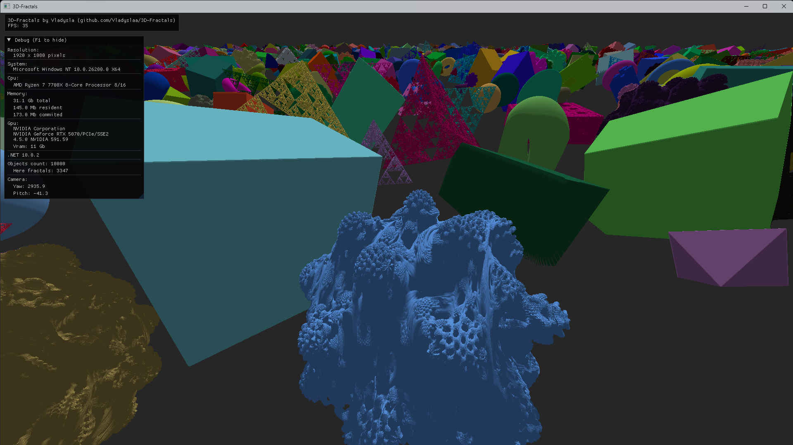

# 3D-Fractals

3D-Fractals is an educational, experimental 3D raymarching renderer written in C# using OpenGL, Silk.NET, and ImGui.
The project started as a learning exercise focused on rendering 3D fractals, but gradually evolved into a more complex real-time raymarching demo with scene editing, serialization, and GPU-side acceleration structures.

> This project is not production-ready. The architecture is experimental and optimized for learning and exploration.

## Overview

- Real-time raymarching renderer

- Fully GPU-based rendering (fragment and vertex shader only)

- Support for classical SDF primitives and complex 3D fractals

- Interactive camera and scene manipulation via ImGui

- Scene and player serialization to JSON

- BVH acceleration structure transferred to the GPU via SSBO

- The renderer is intentionally flexible: shaders are stored as external .glsl files and can be freely modified to implement alternative raymarching or rendering techniques.

## Features
### Rendering

- Fragment-shader-based raymarching

- Signed Distance Field (SDF) evaluation

- Soft shadows

- Simple global illumination model (sun-like directional light)

- Euler-based object rotation

- Per-object color, position, scale, and orientation

### Supported Primitives & Fractals

- Sphere

- Cube
  
- Torus

- Hexagonal prism

- Cone

- Octahedron

- Mandelbulb

- Menger sponge

- Sierpinski tetrahedron

### Camera

- Free-fly camera

- Yaw / pitch mouse control

- Adjustable movement speed and mouse sensitivity

- Cursor lock / unlock

### User Interface (ImGui)

- Real-time FPS counter

- Basic system information

- Enable / disable individual UI menus (F1–F4)

- Player movement and sensitivity settings

- Procedural random world generation with parameters

- Save and load worlds

## Controls
### Keyboard

- W / A / S / D — Move forward / left / backward / right

- Q / E — Move down / up

- Alt — Lock / unlock mouse cursor

- F1–F4 — Toggle individual ImGui menus

### Mouse

- Mouse movement — Camera yaw / pitch

## Technical Details
### Technology Stack

- Language: C#

- Developed with .NET 10, but compatible with .NET 8 with minor code changes

- Graphics API: OpenGL

> Minimum required: OpenGL 4.3 Core

### Libraries:

- Silk.NET (Core, DXDI, GLFW, Input, OpenGL, OpenGL ImGui integration, Windowing, Maths)

- Dear ImGui

- System.Management(only for windows)

## Rendering Architecture

Rendering is executed entirely in the fragment shader

- No compute shaders are used

- Scene data is uploaded via Shader Storage Buffer Objects (SSBOs)

- Objects are stored in a flat array (no hierarchy)

- BVH (Bounding Volume Hierarchy) is built on the CPU and transferred to the GPU to reduce raymarching steps

### Shader Interface

The fragment shader receives, among others:

- Camera vectors (resolution, camera position, camera front / up / right )

- Global directional light vector

- Object buffer (SDF objects)

- BVH node buffer

> Shaders are stored as external .glsl text files.
> There is no hot-reload; shader changes require restarting the application.

## Serialization

World data is stored as JSON flat array of objects with properties:

- type

- position

- size

- Euler rotation

- color

> Player data (camera position, orientation, settings) is saved separately and automatically

## Performance Notes

Test system:

- CPU: Ryzen 7 7700X

- GPU: RTX 5070

- OS: Windows 11

Approximate performance:

10,000 objects, ~40 FPS at 1920×1080

> No upscaling or temporal techniques used

> Performance depends heavily on scene complexity and raymarching depth.

## Build & Run
Supported Platforms

- Windows

- Linux

- macOS

### Releases

Two binaries are provided:

- Cross-platform .NET build (all CPUs / all OSes)

- Windows x64 static build (precompiled)

### Requirements

- GPU with OpenGL 4.3 Core support or higher

- Proper graphics drivers installed

- .NET runtime (for non-static builds)

## Project Status

- Educational and experimental

- Considered a final version

- No guaranteed future updates

> Architecture is intentionally simple and non-ideal

> Intended as a learning resource rather than a reusable engine

## License

This project is licensed under the GNU GPL-3.0.
